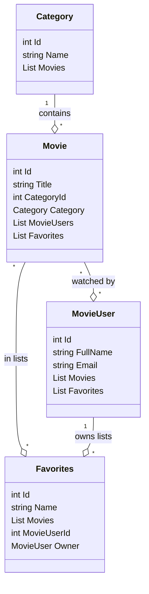

# Models Relationship Diagram

// Checklist (x for done, - for not done):
// - [x] Create diagram folder if needed
// - [x] Create mermaid diagram for relationships
// - [x] Show one-to-many and many-to-many relationships
// - [x] Add Favorites model and update diagram
// - [x] Show one-to-many and many-to-many relationships
